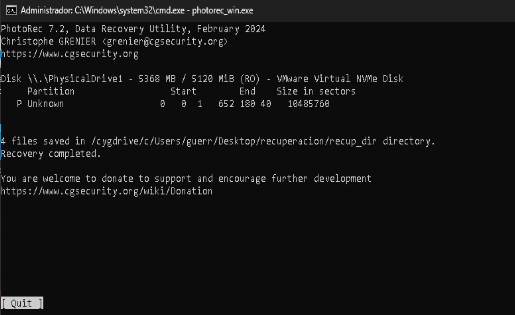

# 📂 Laboratorio: Recuperación Forense de Datos (CLI & Forensics)

Este proyecto documenta el procedimiento técnico para recuperar información crítica tras un fallo lógico o error humano (formateo/borrado de partición) utilizando herramientas de línea de comandos y escaneo de firmas.

## 🎯 Escenario de Prueba
1. **Unidad Objetivo:** Disco secundario de 5GB inicializado en GPT.
2. **Acción del "Usuario":** Borrado accidental de archivos y posterior ejecución del comando `clean` en Diskpart (destrucción de la tabla de particiones).
3. **Estado del Disco:** "No inicializado" / Espacio no asignado.

---

## 🛠️ Fase 1: Preparación y Fallo Simulado
Para garantizar una práctica real, se utilizó la herramienta `diskpart` para gestionar el almacenamiento desde la terminal.

### Configuración del Disco mediante CMD:
```cmd
diskpart
select disk 1
clean
convert gpt
create partition primary
format fs=ntfs quick label="EVICENCIA"
assign letter=E
```
Se procedió a cargar archivos de prueba (JPG, TXT, PDF) en la unidad E: antes de ejecutar un segundo comando clean para simular la pérdida total de acceso.
## Fase 2:Analisis y Recuperacion con PhotoRec
Al desaparecer la unidad lógica, se utilizó PhotoRec para realizar una recuperación basada en firmas (Signature-based recovery).

## **Procedimiento Tecnico:**
1. **Selección del Origen:** Identificación del disco físico de 5GB (Harddisk 1).
2.**Tipo de Escaneo:** Se seleccionó `[Whole Disk]` para buscar fragmentos de archivos en sectores que el sistema operativo ya no reconoce como particionados.
3.**Filtro de Archivos:** Configuración de `File Opt` para buscar específicamente cabeceras:
   - `JPG`
   - `PDF`
   - `TXT`
<p align="center">

</p>

## Conceptos tecnicos Aprendidos:
1.**por que es posible recuperar los datos?**
Cuando se ejecuta un borrado o un formateo rápido, Windows no sobreescribe los bits de información. Simplemente marca el espacio como "Disponible" en la Master File Table (MFT). Los datos siguen físicamente en los platos/celdas del disco hasta que nuevos datos ocupan su lugar.
2.Recuperación por Firmas vs. Recuperación por Índice
- **Recuperacion por indice (WinFR/Recuva):** Busca en el mapa del sistema de archivos. Es mas rapido pero falla si la particion esta dañada.
- **Recuperacion por firmas(PhotoRec)**: Ignora el sistema de archivos y lee los Magic Numbers de cada sector. Es el método más efectivo para discos corruptos o formateados.
## Resultados del laboratorio
-**Archivos recuperados:** 100% de los archivos cargados inicialmente
-**Observacion:** Los nombres originales de los archivos se perdieron debido a la destrucción de la MFT, pero la integridad del contenido se mantuvo intacta.
**Documentado por:Hector Javier Guerrero Jimenez** Ciberseguridad
